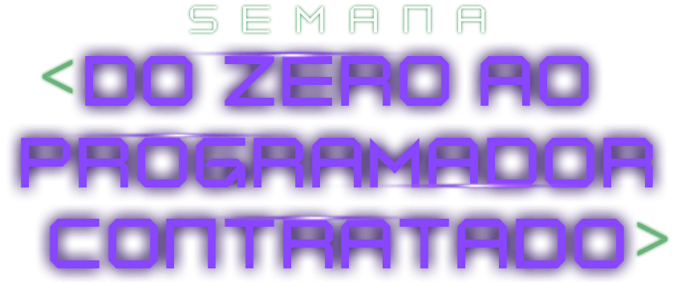
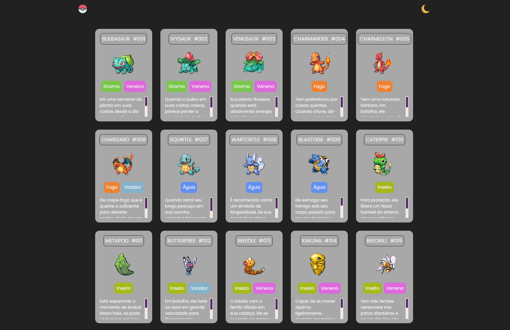

  

  <h2 align="center">Projeto Pokedex Semana do Zero ao Programador Contratado</h2>
  

    <a href="https://luccasfaro.github.io/pokedex/" target="_blank">Ver Site</a>
    &nbsp;·&nbsp;
    <a href="https://github.com/luccasfaro/pokedex/issues" target="_blank">Reportar Bugs</a>
    &nbsp;·&nbsp;
    <a href="https://github.com/luccasfaro/pokedex/issues" target="_blank">Solicitar arquivos</a>
  

 

## **Preview**

 

## Desafio

- Durante uma semana, foram feitas três lives no canal <a href="https://www.youtube.com/c/devemdobro" target="_blank">Dev em dobro</a> e foi proposto o desafio de construir, junto dos mentores, uma pokedex contendo a identificação, o tipo e uma breve descrição de cada <i>Pokémon</i>.
- A página é responsiva para qualquer dispositivo e contém um botão no cabeçalho de página que pode alterar entre: modo claro e modo escuro.

 

## **Feito com**

O projeto foi feito usando as linguagens HTML, CSS e JavaScript, a fim de aprender e desenvolver melhor as mesmas.

 

  &nbsp;  &nbsp;  

 

## **Ferramentas Usadas**

 &nbsp;

 

## **Agradecimento**

* Ricardo e Roberto, pela oportunidade de realizar esse desafio e poder aprimorar minhas habilidades com front-end. [Canal Dev em Dobro](https://www.youtube.com/@DevemDobro/featured)

 

## **Siga-me para mais projetos 👋**

  

 
